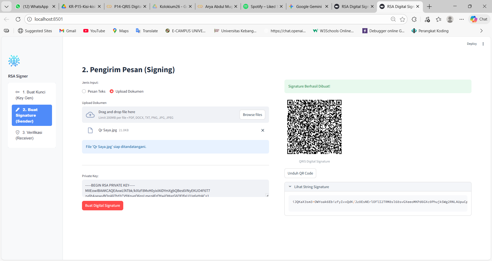
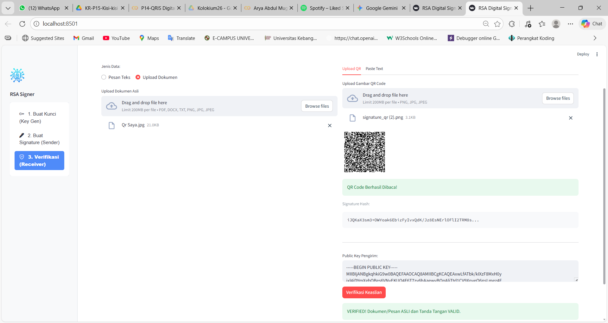

### 1. Halaman Generate Private & Public Key RSA
Pengguna dapat mengunduh ke 2 token agar dapat di lakukan ketika simulasi kirim data dan terima data menggunakan kunci yang sama ketika generate.
 

### 2. Kirim pesan dengan signature RSA Private key
Aktivitas di halaman ini adalah memasukkan pesan atau dokumen dan menyertakan Private Key untuk membuat Signature sebagai pengaman data. Setelah tombol ditekan, akan muncul Key String hasil enkripsi dari isi pesan yang sudah diringkas pakai Hash SHA-256.

### 3. Receiver verifikasi pesan
Sistem memverifikasi pesan dan menghitung ulang hash-nya. Di saat bersamaan, Digital Signature dibuka menggunakan Public Key untuk mengambil hash aslinya. Jika kedua hash tersebut cocok, dokumen dinyatakan asli.
